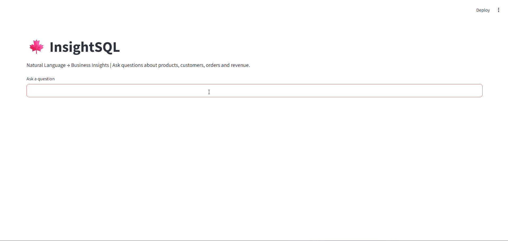
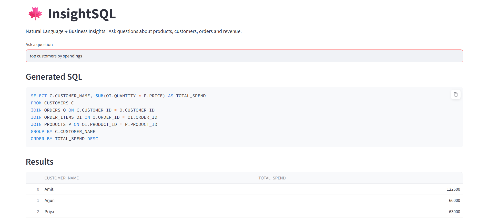
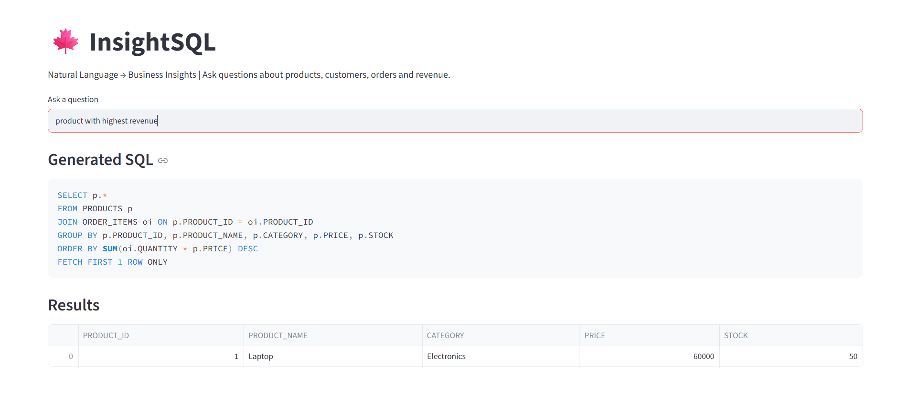

# InsightSQL

AI-powered business intelligence application that converts natural language questions into SQL queries and retrieves insights from a retail database.

<p align="center">
  
</p>

## Features

- Natural Language to SQL conversion
- Oracle Database integration
- Semantic retrieval using ChromaDB
- Few-shot learning with relevant examples
- Groq-powered SQL generation
- Interactive Streamlit dashboard
- Revenue, customer, and inventory analytics

## Architecture

```text
User Question
      │
      ▼
Sentence Transformer
      │
      ▼
ChromaDB
(Semantic Retrieval)
      │
      ▼
Relevant Examples
      │
      ▼
Groq LLM
(SQL Generation)
      │
      ▼
Oracle Database
      │
      ▼
Query Results
      │
      ▼
Streamlit Dashboard
```

## Technology Stack

- Python
- Oracle Database
- Groq
- ChromaDB
- Sentence Transformers
- Streamlit
- Pandas

## Workflow

1. User enters a business question
2. Question is converted into embeddings
3. ChromaDB retrieves similar examples
4. Retrieved examples are added to the prompt
5. Groq generates SQL
6. Oracle executes the query
7. Results are displayed in Streamlit

## Customer Analytics

**Query**

```text
Top customer by spending
```

<p align="center">
  
</p>

---

## Revenue Analytics

**Query**

```text
Which product generated the highest revenue?
```

<p align="center">
  
</p>

---

## Example Questions

- Which product generated the highest revenue?
- Top customer by spending
- Revenue by category
- Most sold product
- Show products with low stock
- Average product price
- Customer spending report

## Project Structure

```text
InsightSQL/
│
├── assets/
│   ├── demo.gif
│   ├── customer_analytics.png
│   └── revenue_analysis.png
│
├── app.py
├── db.py
├── examples.py
├── main.py
├── sql_generator.py
├── vector_store.py
├── pyproject.toml
├── uv.lock
└── README.md
```
